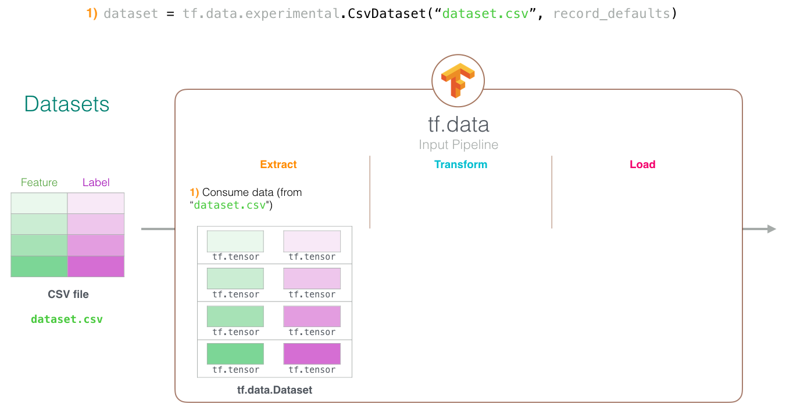
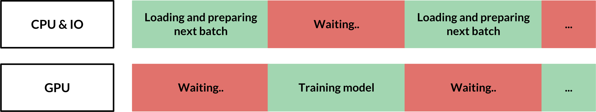
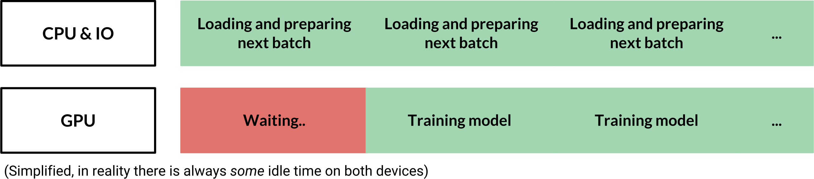
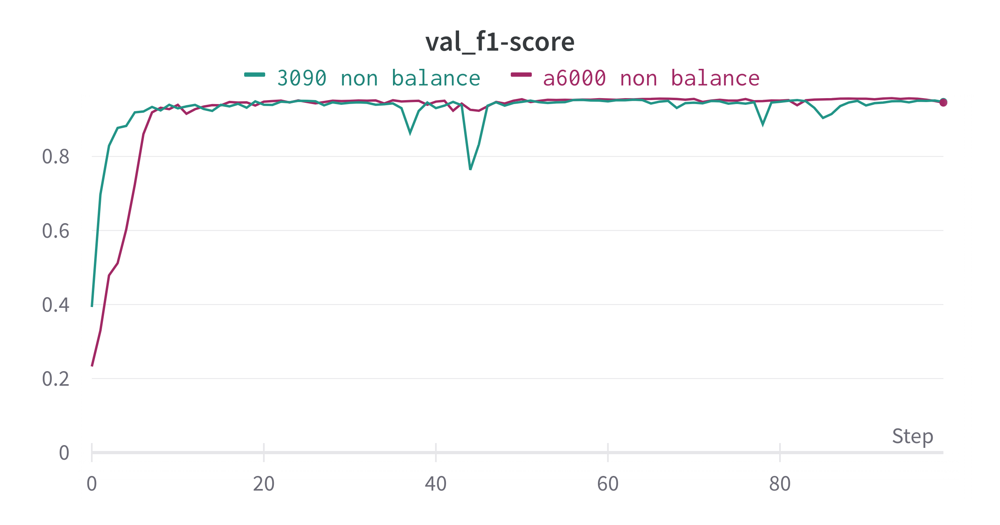
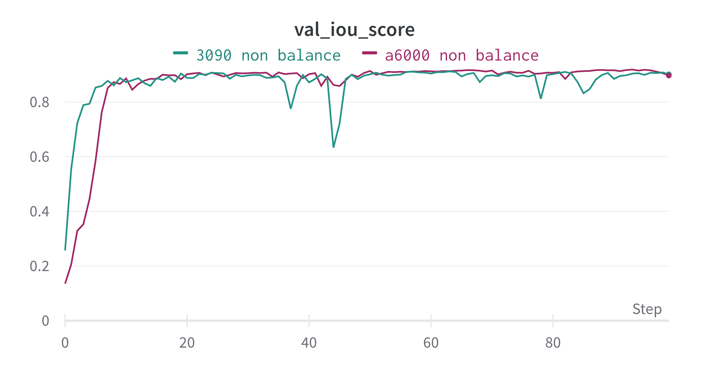
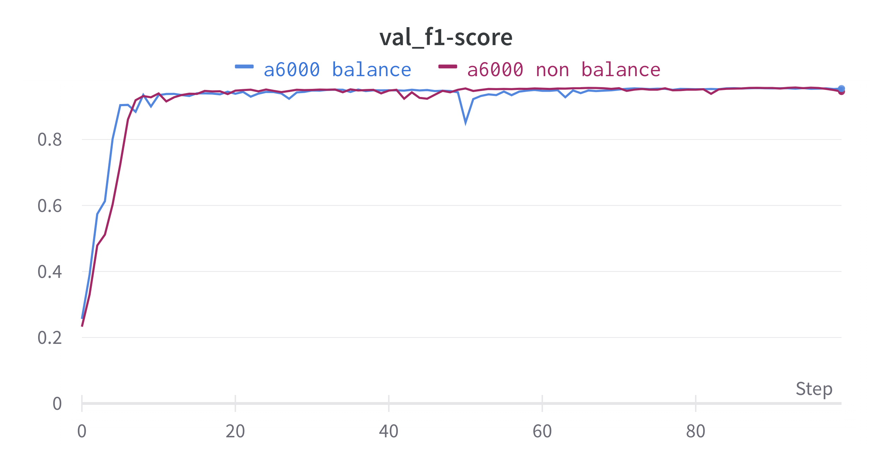
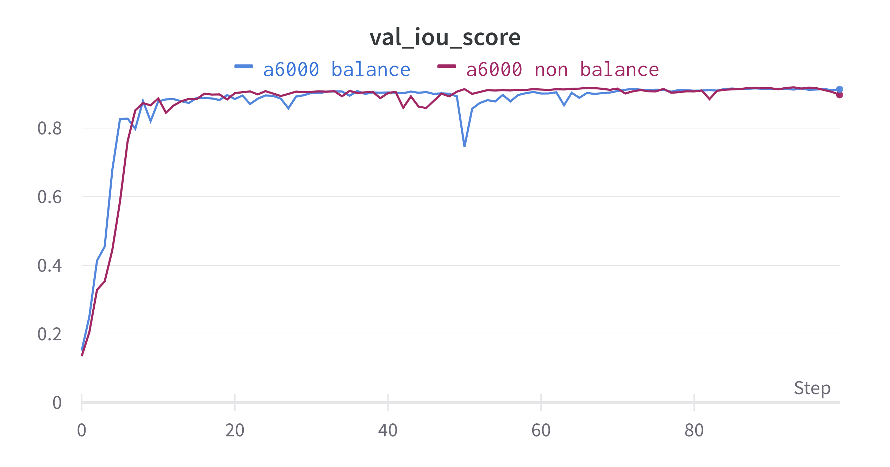

The source code of the post: [Segmentation Model-Part I - Training deep learning segmentation models in Tensorflow](https://hphuongdhsp.github.io/ml-blog/tensorflow/semanticsegmentation/deeplearning/2022/08/02/segmentation-model-part1.html).

# Installation
 
## 1.1 Install the Python environment using Conda

To install `conda`, follow instructions at https://conda.io/projects/conda/en/latest/user-guide/install/linux.html

Note that you will likely need to close and re-open your terminal.
Afterward, you should have ability to run the `conda` command in your terminal.


Run 
```
make conda-update
``` 
to create an environment called `segmentation-tf`, as defined in `environment.yml`. If you want to change the name of environment, change it in `environment.yml`
This environment will provide us with the right Python version as well as the CUDA and CUDNN libraries.

If you edit `environment.yml`, just run `make conda-update` 
again to get the latest changes.

Next, activate the conda environment.

```sh
conda activate segmentation-tf
```

**IMPORTANT**: every time you work in this directory, make sure to start your session with `conda activate segmentation-tf`.

## 1.2 Install Python packages

Next, install all necessary Python packages by running 
```sh
make pip-tools
```

Using `pip-tools` lets us do two nice things:

1. Have a lockfile of exact versions for all dependencies.
2. Allow us to easily deploy to targets that may not support the `conda` environment.

If you add, remove, or need to update versions of some requirements, edit the `.in` files, and simply run `make pip-tools` again.

# Dataloader

This repository is an example of training a segmentation by using tensorflow platform.

The main feature of this repository is the dataloader. We use the tensorflow.data to load the dataset instead of using Sequence of keras. 



------------------------------------------------

The advantage of this method is: 
- Loading data by using multi-processing
- Don't have the memory leak phenomenal 
- Flexible to load dataset, can load weight sample data (using `tf.compat.v1.data.experimental.sample_from_datasets` )
- Downtime and waiting around is minimized while processing is maximized through parallel execution, see the following images: 

### Naive pipeline



---

This is the typical workflow of a naive data pipeline, there is always some idle time and overhead due to the inefficiency of sequential execution.

In contrast, consider:

tf.data pipeline





----------------------------------------------------------------


# Training 

## Dataset 
Download the data from [link](https://drive.google.com/file/d/1qBLwdQeu9nvTw70E46XNXMciB0aKsM7r/view?usp=sharing) and put it in `data_root`, for example

```python
data_root = "/home/aime3/Documents/Phuong/nail-segmentation-dataset"
```
#### You can also change the data_root directy in `--data_root` line of the `utils.py` file

The dataset with be stored at the "data_root", and were organized as the following

```
├── data_root 
│   ├── train
│   │   ├── images
│   │   ├── masks
│   ├── valid 
│   │   ├── images
│   │   ├── masks

```

## Data preparation 

We will

```
python data_preparation.py --data_root data_root
```

In this step we do: 

- Change all image to png to make sure that all images in images folder and masks folder having the same tail

- Make the `train.csv` and `valid.csv` files and stores them in the `data_root/csvfile` folder.
  
- We also split the `train.csv` into several csv file, for the purpose that we will use those files to do a balance data method.

## Training model 

We do 

```
python train.py --data_root data_root --work_dir work_dir --device 0 1 --batch_size 32 --epochs 100 --mixed_precision True
```
where: 


- --data_root is the folder that you store the data,
- --work_dir is the folder that you store weights and logs,
- --device : list of device that you want to train. If you want to train with single gpu, the 
  parameter should be `0`
- --batch_size : batch_size 
- --epochs: number of epoch
- --mixed_precision: Using mixed precision or not 

For convenient, you can fix those parameters at `utils.py` 
### Here we high recommend to use mixed_precision to improve the training speech. 
The following table is the benchmask of training with and without mixed precision, multi gpu 3090

| index | batch_size | mixed precision | gpus | second per epoch | GPU   |
| ----- | ---------- | --------------- | ---- | ---------------- | ----- |
| 1     | 16         | False           | 1    | 46               | 3090  |
| 2     | 16         | True            | 1    | 24               | 3090  |
| 3     | 32         | True            | 2    | 15               | 3090  |
| 4     | 64         | True            | 2    | 13               | a6000 |


### Performance 3090 dual vs a6000 dual 


|                                F1 score                                 |                                Iou score                                 |
| :---------------------------------------------------------------------: | :----------------------------------------------------------------------: |
|  |  |


### Performance Balanced data vs Non balanced data

|                                       F1 score                                       |                                       Iou score                                       |
| :----------------------------------------------------------------------------------: | :-----------------------------------------------------------------------------------: |
|  |  |


-------

## How to set up mixed_precision in the tensorflow platform

The principle of the mixed-precision training is to save the memory of GPU, and we feed the input of the model as the type `float16`. Then, in the model training (using GPU), all calculations up to the last layer are in format `tf.float16`. In the last layer, we will convert it in the format `tf.float32`. The loss calculation uses the `tf.float32`. Using the format `tf.float16` during the calculation in the model, we then save the GPU memory. Then we can increase the batch size of the model. Fro more detail about the mixed-precision training, see [link](https://developer.nvidia.com/blog/video-mixed-precision-techniques-tensor-cores-deep-learning/)

- We first define the global policy: 
```python
if args.mixed_precision:
    policy = mixed_precision.Policy("mixed_float16")
    mixed_precision.set_policy(policy)
    print("Mixed precision enabled")
```
Here `args.mixed_precision` is the boolen parameter for mixed_precision

- Change the out data (input of model) into tf.float16: 
  
When we load dataset, before do suffling and do batching we convert out data into float16. To do that, 
```python
def process_data(image, mask):
    # using tf.numpy_function to apply the aug_img to image and mask
    aug_img, aug_mask = tf.numpy_function(aug_fn, [image, mask], [dtype, dtype])
    return aug_img, aug_mask
```

Where dtype is `tf.float16` if you want to train by the mixed precision and `tf.float32` otherwise. 


- Fix the last layer of the model. Here we remark that the dtype of the last layer should be `float32`. To do that, in the model part, we add some trick lines: 
  
```python
model = sm.Unet(
    "efficientnetb4",
    input_shape=(384, 384, 3),
    encoder_weights="imagenet",
    classes=1,
)
# TO USE mixed_precision, HERE WE USE SMALL TRICK, REMOVE THE LAST LAYER AND ADD
# THE ACTIVATION SIGMOID WITH THE DTYPE  TF.FLOAT32
last_layer = tf.keras.layers.Activation(activation="sigmoid", dtype=tf.float32)(
    model.layers[-2].output
)
model = tf.keras.Model(model.input, last_layer)
```
- Change the optimization: 

```python
optimizer = tfa.optimizers.RectifiedAdam()

if args.mixed_precision:
    optimizer = tf.keras.mixed_precision.LossScaleOptimizer(
        optimizer, dynamic=True
    )
```

--------------------------------

## How to train the model in multiple gpus

Before compiling model we add some code

```
devices = [f"/gpu:{args.device[i]}" for i in args.device]
print(f"Devices:{devices}")
strategy = tf.distribute.MirroredStrategy(devices=devices)
with strategy.scope():
    model = create_model()
```


The weight of model will be save in `models` folder 


## Using log
The defaut log is `None`, we also support writing the training log with:  `wandb` and `tensorboard`
### Wandb
To write log by wandb flatform we first:

```sh
pip install wandb
wandb login

```
Then 

```
python train.py --data_root data_root --work_dir work_dir --device 0 1 --batch_size 16  --epochs 100
```

The log will be update online in the website `https://wandb.ai/home`
### Tensorboard

```
python train.py --data_root data_root --work_dir work_dir --device 0 1 --batch_size 16  --epochs 100 --log tensorboard
```

To see the log, in the terminal windows of the repository, use command

```sh
python3 -m tensorboard.main --logdir={work_dir}/tensorflow/logs/tensorboard
```