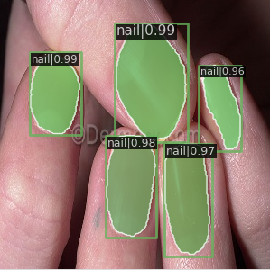
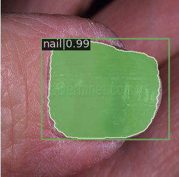
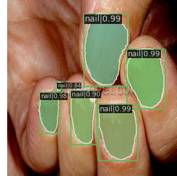

## Abstract

This repository provides an example of using `mmdetection` to solve the intance segmentation problem.

`MMDetection` is an open source object detection toolbox based on PyTorch Platform. This library helps to users easy to training model and deploy it into product.

## 1. Problem Description and Dataset

In this repository, we will cover the nail instance segmentation.


|                                 Images                                 |                                 Masks                                 |
| :--------------------------------------------------------------------: | :-------------------------------------------------------------------: |
|  |  |


### Mission: **We want to have a bounding box and segmentation of each nail in the picture.**


Our original data is organizated as

```
├── Images
│   ├── 1
│       ├── first_image.png
│       ├── second_image.png
│       ├── third_image.png
│   ├── 2
│   ├── 3
│   ├── 4
│   ├── 5
├── Masks
│   ├── 1
│       ├── first_image.png
│       ├── second_image.png
│       ├── third_image.png
│   ├── 2
│   ├── 3
│   ├── 4
│   ├── 5

```


## 2. Training Instance Segmentation by MMDetection

The basic steps:

- Prepare the customized dataset

- Prepare a config

- Train, test, inference models on the customized dataset.

-------

### Prepare the customized dataset

Reorganize the dataset into COCO format.

For example the coco training annotation has the following format

```
{
    "images": [images],
    "annotations": [annotations],
    "categories": [categories]
}
```

Where: 

- `"images"` (type: [List[Dict]]) is the list of dictionaries, each dictionary has informations
    - "id": 100   The id of image
    - "file_name": "train/images/1/image_100.png",  the path to get image
    - "width": 1800,   
    - "height": 1626


- `"annotations"`  is the list of dictionaries, each dictionary has informations

    - "id": 350, id of object (not the image id)
    - "image_id": 100, id of image
    - "category_id": 1, id of categories
    - "segmentation": RLE or [polygon],
    - "area": float,
    - "bbox": [x,y,width,height],
    - "iscrowd": 0 or 1,

- `"categories"`  is the list of dictionaries, each dictionary has informations
    - "id": int = 0 id of categories
    - "name": str = "nail"

----------------------------------------------------------------

The following is an example of coco file format
```
{
    "images": [image],
    "annotations": [annotation],
    "categories": [category]
}


image = {
    "id": int,
    "width": int,
    "height": int,
    "file_name": str,
}

annotation = {
    "id": int,
    "image_id": int,
    "category_id": int,
    "segmentation": RLE or [polygon],
    "area": float,
    "bbox": [x,y,width,height],
    "iscrowd": 0 or 1,
}

categories = [{
    "id": int,
    "name": str,
    "supercategory": str,
}]
```
------------

## Prepare the coco format dataset for the nail segmentation. 


We first download the data from [link](https://storage.torus.lan/sharing/C1CexIWDV) and put it in your local machine paht, namely,  `base_path`, for example

```ssh
base_path = "/home/aime3/Documents/Phuong/nail-segmentation-dataset"
```

- For convenient, we will store all of dataset information in the csv files: 

images,masks,width,height

| images                 | masks                 | width | height |
| ---------------------- | --------------------- | ----- | ------ |
| images/1/filename1.png | masks/1/filename1.png | 256   | 256    |
| images/1/filename1.png | masks/1/filename1.png | 256   | 256    |
| images/2/filename1.png | masks/2/filename1.png | 256   | 256    |
| images/2/filename1.png | masks/2/filename1.png | 256   | 256    |

The function `make_csv_file'` helps us do the above task. 

- We then convert the train csv file and valid csv file into the coco format. 
We use `get_json_coco` to do that task. 

Finally, we have:
- the raw dataset is stored at `base_path`
- the coco format annotation is stored at `/csv_file/` folder.

To do all of them we just use command line

```
python data_preprocessing.py base_path
```

-------------------------
## 3. Prepare a configuration. 

For the configuration, we have some modules to modify:

- model
- data
- schedules
- default_runtime

All of parameters is stored at `configs/_base_`

```
├── configs
│   ├── _base_
│       ├── datasets
│       ├── models
│       ├── schedules
│       ├── defaut_runtime.py
```
Here `datasets, models, schedules, default_runtime` store corresponding some avaiable datasets, models, schedules, default_runtime. 

You can find the configs folder at [mmdetection github](https://github.com/open-mmlab/mmdetection)


In this repository, we are focus on 2 main things: model and dataset. To get more information about, please read [mmdetection Tutorials](https://mmdetection.readthedocs.io/en/stable/tutorials/config.html)


We will make a simple configuration that permits to us change model and the dataset.

Your config file is saved at `configs/nail_configs`, it has the following form. 

-------

```
_base_ = "mask_rcnn/mask_rcnn_r50_caffe_fpn_mstrain-poly_1x_coco.py"


# We also need to change the num_classes in head to match the dataset's annotation
model = dict(roi_head=dict(bbox_head=dict(num_classes=1), mask_head=dict(num_classes=1)))
# Modify dataset related settings
dataset_type = "COCODataset"
classes = ("nail",)
data = dict(
    train=dict(
        img_prefix="/home/aime3/Documents/Phuong/nail-segmentation-dataset/",
        classes=classes,
        ann_file="/home/aime3/Documents/Phuong/nail-segmentation-dataset/coco_label/train_coco.json",
    ),
    val=dict(
        img_prefix="/home/aime3/Documents/Phuong/nail-segmentation-datase/",
        classes=classes,
        ann_file="/home/aime3/Documents/Phuong/nail-segmentation-dataset/coco_label/valid_coco.json",
    ),
    test=dict(
        img_prefix="/home/aime3/Documents/Phuong/nail-segmentation-dataset/",
        classes=classes,
        ann_file="/home/aime3/Documents/Phuong/nail-segmentation-dataset/coco_label/valid_coco.json",
    ),
)

```
-------

Where
 
###  What is **_base_**? 
```
_base_ = "mask_rcnn/mask_rcnn_r50_caffe_fpn_mstrain-poly_1x_coco.py"
```

means that we inherit the config file `mask_rcnn/mask_rcnn_r50_caffe_fpn_mstrain-poly_1x_coco.py`

with some information that: 
- the type model: `mask_rcnn`, you can find the config file of that model at `_base_./models/mask_rcnn_r50_fpn.py`. That model use the `resnet 100` as the backbone. 
- the backbone: `resnet 50`
- the pretrained in the `caffe` platform
- the neck: `fpn` (Feature Pyramid Networks)

- miscellaneous setting/plugins of model is `mstrain`: means multi-scale at the data loader, more detail, we can compare the
data_pipeline with anh without `mstrain`

```
## with mstrain:  

img_norm_cfg = dict(mean=[103.530, 116.280, 123.675], std=[1.0, 1.0, 1.0], to_rgb=False)
train_pipeline = [
    dict(type="LoadImageFromFile"),
    dict(type="LoadAnnotations", with_bbox=True, with_mask=True),
    dict(
        type="Resize",
        img_scale=[(1333, 640), (1333, 672), (1333, 704), (1333, 736), (1333, 768), (1333, 800)],
        multiscale_mode="value",
        keep_ratio=True,
    ),
    dict(type="RandomFlip", flip_ratio=0.5),
    dict(type="Normalize", **img_norm_cfg),
    dict(type="Pad", size_divisor=32),
    dict(type="DefaultFormatBundle"),
    dict(type="Collect", keys=["img", "gt_bboxes", "gt_labels", "gt_masks"]),
]
test_pipeline = [
    dict(type="LoadImageFromFile"),
    dict(
        type="MultiScaleFlipAug",
        img_scale=(1333, 800),
        flip=False,
        transforms=[
            dict(type="Resize", keep_ratio=True),
            dict(type="RandomFlip"),
            dict(type="Normalize", **img_norm_cfg),
            dict(type="Pad", size_divisor=32),
            dict(type="ImageToTensor", keys=["img"]),
            dict(type="Collect", keys=["img"]),
        ],
    ),
]

```
----------------------------------------------------------------

```
without mstrain

img_norm_cfg = dict(
    mean=[103.530, 116.280, 123.675], std=[1.0, 1.0, 1.0], to_rgb=False)
train_pipeline = [
    dict(type='LoadImageFromFile'),
    dict(type='LoadAnnotations', with_bbox=True, with_mask=True),
    dict(type='Resize', img_scale=(1333, 800), keep_ratio=True),
    dict(type='RandomFlip', flip_ratio=0.5),
    dict(type='Normalize', **img_norm_cfg),
    dict(type='Pad', size_divisor=32),
    dict(type='DefaultFormatBundle'),
    dict(type='Collect', keys=['img', 'gt_bboxes', 'gt_labels', 'gt_masks']),
]
test_pipeline = [
    dict(type='LoadImageFromFile'),
    dict(
        type='MultiScaleFlipAug',
        img_scale=(1333, 800),
        flip=False,
        transforms=[
            dict(type='Resize', keep_ratio=True),
            dict(type='RandomFlip'),
            dict(type='Normalize', **img_norm_cfg),
            dict(type='Pad', size_divisor=32),
            dict(type='ImageToTensor', keys=['img']),
            dict(type='Collect', keys=['img']),
        ])
]

```
- The learning rate schedule is: polinomial and number of epoch is: 12
- The dataset: `coco`

-------
### Modify dataset to adapt with pipeline

For the dataset we need only chane the path of images and annotations.
-------
### Modify **model**

For the model, we need only change the number of channel: 

```
model = dict(roi_head=dict(bbox_head=dict(num_classes=1), mask_head=dict(num_classes=1)))
```

For more details about the config, you can find at configs/configuration_example.py


--------------------------------
## Training model

Once we finish modify the config, we continue with training model

```
python train.py configs/nail_config.py

```


### Testing 


```
python test.py configs/details_config.py --checkpoint checkpoint_path --eval bbox segm
```

### Inference 

```
python inference.py
```
 

See some results:


|                               Image1 1                               |                               Image 2                                |
| :------------------------------------------------------------------: | :------------------------------------------------------------------: |
|  |  |


|                               Image1 3                               |                               Image 4                                |
| :------------------------------------------------------------------: | :------------------------------------------------------------------: |
|  |  |


## 4. Deep Dive in config

In this part, we will discuss how to modify your own config, without using the `__base__` file. An example of modifing config is `configs/configuration_example.py`. 

For example, now we want to use the `"mask_rcnn/mask_rcnn_r50_caffe_fpn_mstrain-poly_1x_coco.py"` to our dataset.

Here are all of step we need to write.
- datasets: 
    - Data format: `coco`
    - data_pineline: `mstrain`
    - path to the images and annotations
- schedules: `poly_1x` in schedule folder
- model: 
    - head bbox
    - head max
    - pretrained: caffe, link to download weight
    - backbone
    - neck

### Changing data loader.

Remark that, we want to use the coco format, the we can inherit the coco data, that is in `configs/__base__/dataset/coco_instance.py`

- We need to change the `data_root`, defaut is `'data/coco/'`
- Then we need to change the mstrain parameter

```
img_norm_cfg = dict(
    mean=[103.530, 116.280, 123.675], std=[1.0, 1.0, 1.0], to_rgb=False)
train_pipeline = [
    dict(type='LoadImageFromFile'),
    dict(type='LoadAnnotations', with_bbox=True, with_mask=True),
    dict(type='Resize', img_scale=(1333, 800), keep_ratio=True),
    dict(type='RandomFlip', flip_ratio=0.5),
    dict(type='Normalize', **img_norm_cfg),
    dict(type='Pad', size_divisor=32),
    dict(type='DefaultFormatBundle'),
    dict(type='Collect', keys=['img', 'gt_bboxes', 'gt_labels', 'gt_masks']),
]
test_pipeline = [
    dict(type='LoadImageFromFile'),
    dict(
        type='MultiScaleFlipAug',
        img_scale=(1333, 800),
        flip=False,
        transforms=[
            dict(type='Resize', keep_ratio=True),
            dict(type='RandomFlip'),
            dict(type='Normalize', **img_norm_cfg),
            dict(type='Pad', size_divisor=32),
            dict(type='ImageToTensor', keys=['img']),
            dict(type='Collect', keys=['img']),
        ])
]

```

### Change schedules

We just copy directly from `configs/__base__/schedules/`, for that part, we can change what ever you want. This

### Change defaut_runtime

### Change model.

For the model we need to be careful about the parameter to make sure that there are no conflict.

- Change backbone: 

```
backbone=dict(
    type="ResNet",
    depth=50,
    num_stages=4,
    out_indices=(0, 1, 2, 3),
    frozen_stages=1,
    norm_cfg=dict(type="BN", requires_grad=False),
    norm_eval=True,
    style="caffe",
    init_cfg=dict(type="Pretrained", checkpoint="open-mmlab://detectron2/resnet50_caffe"),
)
```

Change neck 

```
neck=dict(type="FPN", in_channels=[256, 512, 1024, 2048], out_channels=256, num_outs=5),
```
Similar to head, bbox_head, mask_head. 
## Installation  
#### First: Install the Python environment using Conda

To install `conda`, follow instructions at https://conda.io/projects/conda/en/latest/user-guide/install/linux.html

Note that you will likely need to close and re-open your terminal.
Afterward, you should have ability to run the `conda` command in your terminal.

Run 
```
make conda-update
``` 
to create an environment called `onnx`, as defined in `environment.yml`.
This environment will provide us with the right Python version as well as the CUDA and CUDNN libraries.

If you edit `environment.yml`, just run `make conda-update`
again to get the latest changes.

Next, activate the conda environment.

```sh
conda activate mmdet
```

**IMPORTANT**: every time you work in this directory, make sure to start your session with `conda activate mmdet`.

#### Next: install Python packages

Next, install all necessary Python packages by running 
```sh
make pip-tools
```

Using `pip-tools` lets us do three nice things:

1. Separate out dev from production dependencies (`requirements-dev.in` vs `requirements.in`).
2. Have a lockfile of exact versions for all dependencies (the auto-generated `requirements-dev.txt` and `requirements.txt`).
3. Allow us to easily deploy to targets that may not support the `conda` environment.

If you add, remove, or need to update versions of some requirements, edit the `.in` files, and simply run `make pip-tools` again.
